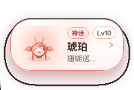
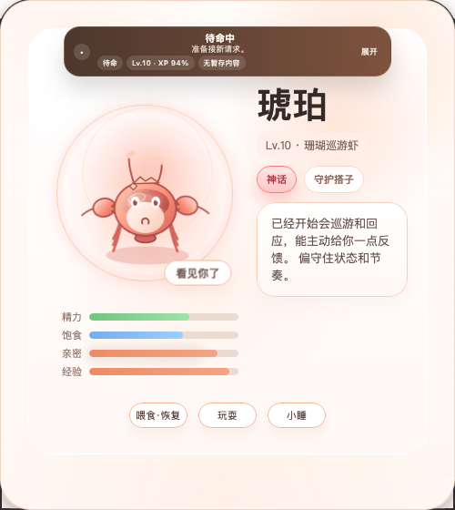
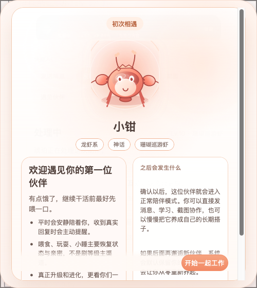

# LittleClaw Companion

[English](README.md) | 简体中文

LittleClaw Companion 是一个为 OpenClaw 设计的宠物式桌面陪伴体。

它把下面几件事结合到了一起：
- 桌面悬浮 Companion
- 由真实 OpenClaw 使用驱动的宠物成长系统
- 截图 / 文件 / 直发到当前 OpenClaw 会话的桥接能力
- 可扩展的种族 / 稀有度 / 进化预设，后续可继续产品化为可复用插件


## 界面预览

### 收起态宠物 Badge


更轻量的桌面悬浮形态，只保留宠物本体和关键信息提醒。

### 展开态主界面


宠物主导的主舞台，保留状态条、角色信息和主要互动动作。

### 灵动岛工作台


用于承接发送、学习、查看回复、截图和遇见伙伴等快捷操作。

### 学习链路


支持填写学习主题与目标，并携带截图或文件进入真实学习流程。

### 首宠欢迎页


首次安装时展示当前伙伴和成长说明，确认后进入正常陪伴模式。

## 当前状态

目前已经可用：
- Companion 桌面壳
- 宠物 API 和持久化宠物状态
- XP + Affinity 双轨成长系统
- 种族 / 稀有度预设加载
- 截图 / 文件暂存与上传到当前 OpenClaw 聊天
- 龙虾、灵体、机甲、夜蛾、史莱姆、鸟系、灵狐、甲虫、锦鲤的统一 Canvas 渲染
- 由安装器管理的 runtime 镜像
- 首宠欢迎与初次相遇流程

仍在继续完善：
- 多种族的高质量正式资产包
- 安装时首宠揭晓的完整体验
- 更完整的 GitHub 开源分发流程

## 快速开始

要求：
- macOS
- 已经在本机安装 OpenClaw
- 本地存在 `~/.openclaw`

安装：

```bash
./installer/install.sh
```

升级：

```bash
./installer/upgrade.sh
```

卸载：

```bash
./installer/uninstall.sh
```

安装完成后：
- 宠物服务应运行在 `http://127.0.0.1:18793`
- Companion LaunchAgent 应已安装
- 你现有的宠物会被保留；如果是首次安装，会自动初始化首宠

常用检查命令：

```bash
curl -s http://127.0.0.1:18793/health
curl -s http://127.0.0.1:18793/pet
/bin/zsh -lc "launchctl print gui/$(id -u)/ai.openclaw.littleclaw-companion"
```

## 运行时目录

安装器管理的运行时路径：
- runtime：`~/.openclaw/workspace/littleclaw-runtime`
- presets：`~/.openclaw/workspace/littleclaw-presets`
- assets：`~/.openclaw/workspace/littleclaw-assets`
- pet state：`~/.openclaw/workspace/memory/pet-state.json`

## 仓库结构

- `core/`：宠物领域模型与成长规则
- `bridge/`：与 OpenClaw 的桥接层
- `ui/`：桌面 Companion UI
- `presets/`：稀有度、成长、种族预设
- `installer/`：安装、升级、卸载入口
- `docs/`：产品与技术设计文档

## 文档

- 安装方案：[docs/INSTALL_PLAN.md](docs/INSTALL_PLAN.md)
- 插件架构：[docs/PLUGIN_ARCHITECTURE.md](docs/PLUGIN_ARCHITECTURE.md)
- 产品路线图：[docs/PRODUCT_ROADMAP.md](docs/PRODUCT_ROADMAP.md)
- 快速开始：[docs/QUICKSTART.md](docs/QUICKSTART.md)
- 发布检查清单：[docs/RELEASE_CHECKLIST.md](docs/RELEASE_CHECKLIST.md)
- 发布内容清单：[docs/RELEASE_CONTENTS.md](docs/RELEASE_CONTENTS.md)
- 开源说明：[docs/OPEN_SOURCE_NOTES.md](docs/OPEN_SOURCE_NOTES.md)

## 当前推荐路径

当前主要支持的实现路径：
- 安装器管理的 Python + WebView runtime
- 安装器管理的宠物服务
- 安装器管理的 Companion LaunchAgent

如果你只想走当前官方支持路径，直接使用：
- `./installer/install.sh`
- `./installer/upgrade.sh`
- `./installer/uninstall.sh`
- `./installer/package-release.sh`

## Legacy / Experimental

下面这些文件仍然保留，主要用于开发历史或实验用途，不是当前首发主路径：
- `companion.py`
- `companion_appkit.py`
- `run-appkit.sh`
- `run-companion.sh`
- `build-app.sh`
- `Sources/main.swift`

## 说明

- 默认会保留现有宠物成长进度。
- `喂食 / 玩耍 / 小睡` 主要恢复状态和提升亲密，不是主要升级渠道。
- 真正的 XP 和进化更多来自真实工作行为。
- 种族和稀有度已经配置化，但完整视觉资产系统仍在继续扩展。
